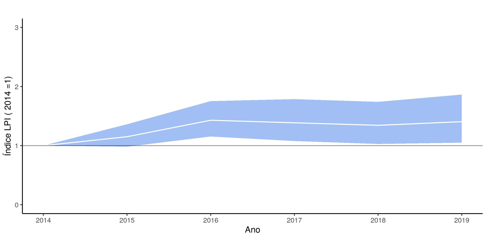

# Programa-Monitora-Florestal-Global
Analise de dados Mastoaves do protocolo florestal global do **Programa Monitora-ICMBio**

Prepara os dados do Monitora-ICMBio no formato exigido pelo pacote *rlpi* desenvolvido pela [**Zoological Society of London**](https://github.com/Zoological-Society-of-London/rlpi);

Cria subsets dos dados com UC e grupo taxonômico de interesse (e.g., mamíferos, aves);

Calcula o **LPI (Living Planet Index)** a partir de dados do protocolo florestal básico (mamíferos e aves)



Figura 1. LPI para 408 populações de mamíferos e aves em 27 UCs monitoradas pelo ICMBio, 2014-2019.


### Descrição
```src``` Contém os códigos para as análises.

```data``` Dados brutos e processados. 

```bin``` Códigos e funções úteis que são chamadas pelos códigos principais.

```results``` Contém resultados das análises.

# Instruções para instalar o repositório localmente no R
Se você pretende usar o R mas nunca fez isso antes, veja abaixo as instruções para instalar o R, RStudio e Git.
1. Instalar o R: Você pode baixar a versão mais atualizada do R [aqui](https://cran.rstudio.com).
2. Instalar o Rstudio: [link para download do Rstudio](https://www.rstudio.com/products/rstudio/download/)
3. Instalar o Git: [Veja essas notas para instalação](https://support.rstudio.com/hc/en-us/articles/200532077-Version-Control-with-Git-and-SVN) -  _somente necessário se você quiser compartilhar seu código com esse repositório e/ou quiser manter sua cópia local atualizada na medida em que atualizamos e melhoramos o código aqui_.
4. Clone ou baixe esse repositório - _botão verde à direita no alto da página_.

# Instruções para instalar o *RLPI*

1 - Instale o pacote devtools do R
```r
install.packages("devtools")
```

2 - Instale o pacote **rlpi** da Zoological-Society-of-London
```r
library(devtools)

install_github("Zoological-Society-of-London/rlpi", dependencies=TRUE)
```


# Contato
<elildojr@gmail.com>
