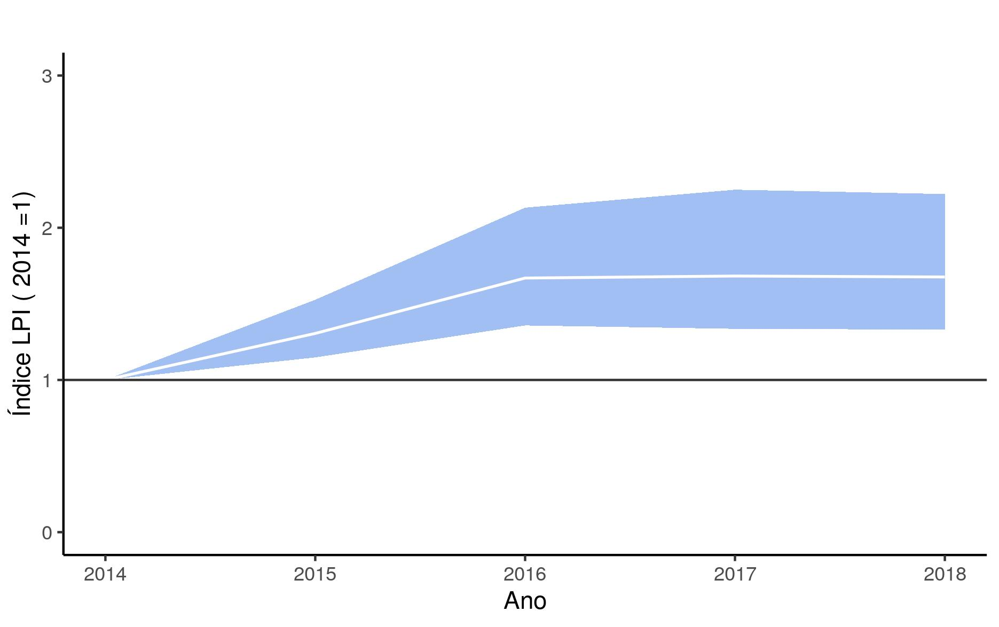

# Programa-Monitora-Florestal-Global
Analise de dados Mastoaves do protocolo florestal global do **Programa Monitora-ICMBio**

Prepara os dados do Monitora-ICMBio, colocando-os no formato exigido pelo pacote *rlpi*, desenvolvido pela [**Zoological Society of London**](https://github.com/Zoological-Society-of-London/rlpi);

Cria subsets dos dados com UC e grupo taxonômico de interesse (e.g., mamíferos, aves);

Calcula o **LPI (Living Planet Index)** a partir de dados do protocolo florestal básico (mamíferos e aves)


### Descrição
```src``` Contém os códigos para as análises.

```data``` Dados da amostragem com armadilhas fotográficas no Uei-Tepui, Novembro de 2019 a Fevereiro de 2020. 

```bin``` Códigos e funções úteis que são chamadas pelos códigos principais.

```results``` Contém os resultados das análises, como tabelas e figuras.




Figura 1. LPI Global para os dados do ICMBio, 2014-2018.


### Instruções para execução do script

1 - Instale o pacote devtools do R

```r
install.packages("devtools")
```

2 - Instale o pacote **rlpi** da Zoological-Society-of-London


```r
library(devtools)

install_github("Zoological-Society-of-London/rlpi", dependencies=TRUE)
```

```
## O pacote 'ggplot2' foi montado com a versão 3.2.5 do R
```

Com isso o script pode ser executado normalmente


# Contato
<elildojr@gmail.com>
