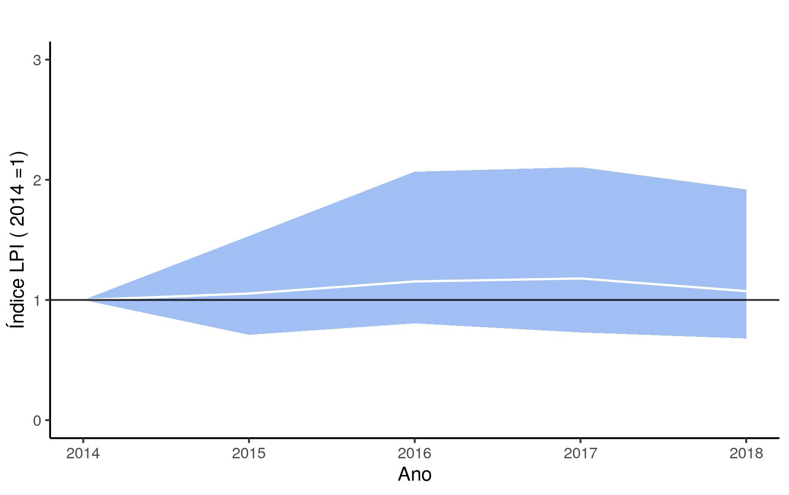

# Programa-Monitora-Florestal-Global
Analise de dados Mastoaves do protocolo florestal global do **Programa Monitora-ICMBio**

Prepara os dados do Monitora-ICMBio no formato exigido pelo pacote *rlpi*, desenvolvido pela [**Zoological Society of London**](https://github.com/Zoological-Society-of-London/rlpi);

Cria subsets dos dados com UC e grupo taxonômico de interesse (e.g., mamíferos, aves);

Calcula o **LPI (Living Planet Index)** a partir de dados do protocolo florestal básico (mamíferos e aves)




Figura 1. LPI para 108 populações de 27 espécies de aves em 18 UCs monitoradas pelo ICMBio, 2014-2018.


### Descrição
```src``` Contém os códigos para as análises.

```data``` Dados brutos e processados. 

```bin``` Códigos e funções úteis que são chamadas pelos códigos principais.

```results``` Contém resultados das análises.


# Instruções para instalação do *RLPI*

1 - Instale o pacote devtools do R
```r
install.packages("devtools")
```

2 - Instale o pacote **rlpi** da Zoological-Society-of-London
```r
library(devtools)

install_github("Zoological-Society-of-London/rlpi", dependencies=TRUE)
```


# Contato
<elildojr@gmail.com>
